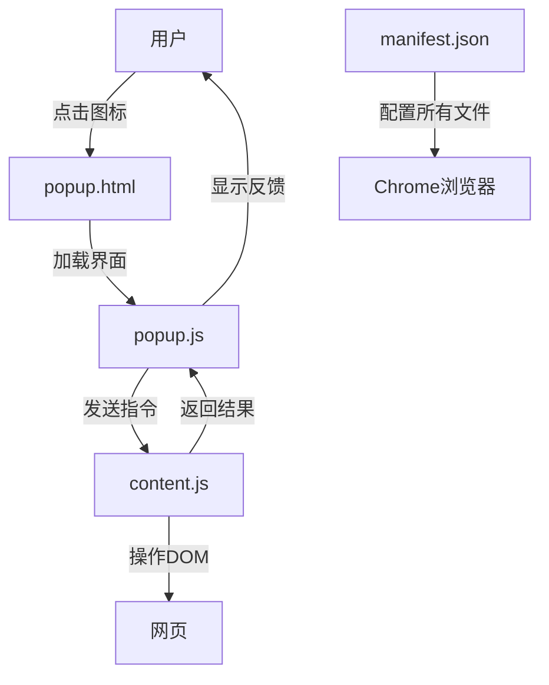

# Overflow Scroll & Catalog Numbering Extension

一个Chrome浏览器扩展，提供两个主要功能：
1. **Overflow Scroll设置**：为指定CSS选择器设置overflow-y: scroll属性
2. **目录编号功能**：为网页目录项自动添加层级编号

## 🆕 新功能：目录编号

### 功能说明
- 自动为目录项添加层级编号（如：1, 2, 3.1, 3.2等）
- 智能识别主要章节和子章节
- 支持编号的添加和移除
- 保留原始文本，便于恢复

### 使用方法
1. 在弹出窗口的"目录编号功能"部分输入目录的CSS选择器
2. 点击"添加编号"为目录项添加编号
3. 点击"移除编号"恢复原始文本

### 使用示例
针对GitHub README页面的目录结构：
```
选择器：#__primerPortalRoot__ > div > div > div > section > nav > ul
```

### 编号规则
- 主要章节（如FastChat、News、Contents等）：获得主编号 1, 2, 3...
- 子章节（如Method 1、Method 2等）：获得子编号 3.1, 3.2...
- 深层子章节：获得更深层编号 6.1, 6.2...

### 测试
打开 `test.html` 文件进行功能测试，使用选择器 `#test-catalog`

## 📁 文件结构及作用说明

```sh
overflow-scroll-extension/
├── manifest.json          # 扩展的核心配置文件
├── content.js             # 注入到页面中的内容脚本
├── popup.html             # 弹出窗口的界面结构
├── popup.js               # 弹出窗口的交互逻辑
├── test.html              # 功能测试页面
└── icons/
    ├── icon16.png         # 工具栏小图标
    ├── icon48.png         # 扩展管理页中图标
    └── icon128.png        # 应用商店展示图标
```

---

## 1. manifest.json - **扩展清单文件**

**作用**：扩展的"身份证"和"说明书"，Chrome 通过此文件了解扩展的基本信息和权限需求。

**核心功能**：
- 定义扩展名称、版本、描述等元信息
- 声明扩展需要的权限（如操作当前标签页、注入脚本等）
- 配置弹出页面(popup)和图标
- 指定内容脚本的注入规则
- 设置扩展 Manifest Version（目前最新为 V3）

**关键配置说明**：
```json
{
  "permissions": [
    "activeTab",     // 只能操作当前激活的标签页，更安全
    "scripting"      // 允许执行脚本内容
  ],
  "content_scripts": [{
    "matches": ["<all_urls>"],  // 匹配所有网址
    "js": ["content.js"],        // 注入的脚本文件
    "run_at": "document_end"     // 在页面加载完成后执行
  }]
}
```

---

## 2. content.js - **内容脚本**

**作用**：直接注入到网页中，与页面 DOM 交互的执行者。

**核心功能**：
- 在页面上下文中执行，可以访问和操作页面的 DOM
- 包含 `setOverflowScroll()` 函数用于设置滚动属性
- 包含 `addCatalogNumbers()` 和 `removeCatalogNumbers()` 函数用于目录编号
- 监听来自弹出窗口(popup)的消息指令
- 执行具体的样式修改和DOM操作
- 将操作结果返回给弹出窗口

**通信机制**：
```javascript
// 监听来自popup或background script的消息
chrome.runtime.onMessage.addListener((request, sender, sendResponse) => {
  if (request.action === "setOverflowScroll") {
    const result = setOverflowScroll(request.selector);
    sendResponse(result); // 返回操作结果
  }
  return true; // 保持异步通信通道开放
});
```

---

## 3. popup.html - **弹出窗口界面**

**作用**：用户点击扩展图标后显示的交互界面。

**核心功能**：
- 提供用户输入 CSS 选择器的文本框（Overflow Scroll功能）
- 提供目录选择器输入框和编号控制按钮（目录编号功能）
- 显示操作按钮和结果反馈
- 定义弹出窗口的样式和布局
- 引入 popup.js 脚本处理用户交互

**UI 组件**：
- Overflow Scroll 输入框：用于输入需要设置滚动的CSS选择器
- 目录编号输入框：用于输入目录结构的CSS选择器
- 功能按钮：开始/停止监控、添加/移除编号
- 状态显示区域：显示当前监控状态
- 结果展示区域：显示操作成功/失败信息

---

## 4. popup.js - **弹出窗口逻辑**

**作用**：处理用户交互，协调 content script 执行操作。

**核心功能**：
- 监听用户点击事件（滚动设置和编号功能）
- 管理本地存储（记住上次使用的选择器）
- 与当前标签页中的 content script 进行通信
- 显示操作结果和状态反馈
- 处理错误情况和用户提示
- 支持多种操作类型的消息路由

**主要工作流程**：
1. 从存储中读取上次使用的选择器
2. 监听按钮点击事件
3. 向当前页面的 content script 发送消息
4. 接收并显示操作结果
5. 保存当前选择器供下次使用

---

## 5. icons/ - **图标资源文件夹**

**作用**：提供不同尺寸的扩展图标，用于不同场景的显示。

**各尺寸图标的用途**：
- `icon16.png` (16x16)：显示在浏览器工具栏右侧
- `icon48.png` (48x48)：在 `chrome://extensions/` 管理页面中显示
- `icon128.png` (128x128)：在 Chrome 应用商店中展示

---

## 🔄 文件间的协作关系



## 🎯 总结对比

| 文件 | 类型 | 运行环境 | 主要职责 | 是否必需 |
|------|------|----------|----------|----------|
| **manifest.json** | 配置文件 | 浏览器扩展系统 | 定义扩展元数据和权限 | ✅ 必需 |
| **content.js** | 内容脚本 | 网页上下文 | 操作页面DOM | ✅ 核心功能 |
| **popup.html** | 用户界面 | 扩展弹出窗口 | 提供用户交互界面 | ✅ 推荐 |
| **popup.js** | 控制脚本 | 扩展弹出窗口 | 处理用户交互和通信 | ✅ 推荐 |
| **icons/** | 资源文件 | 浏览器UI各处 | 扩展视觉标识 | ⚠️ 强烈推荐 |

这样的文件结构确保了扩展的功能完整性、安全性和用户体验。每个文件各司其职，通过 Chrome 扩展API进行通信和协作。